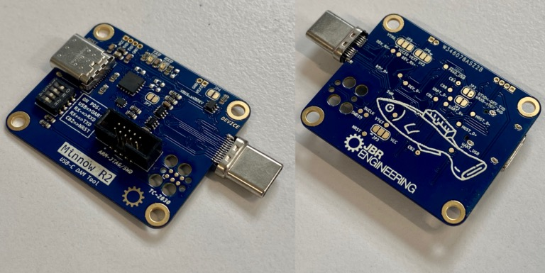
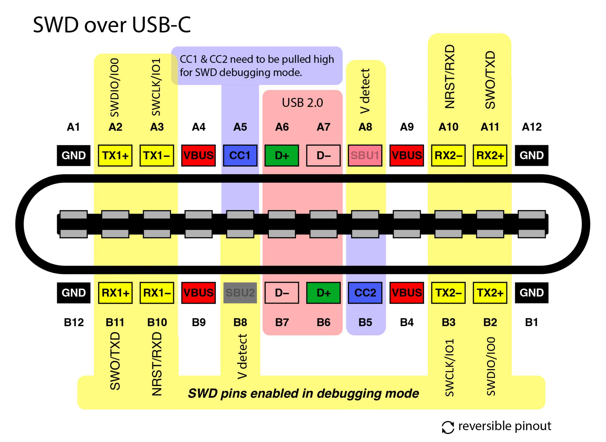
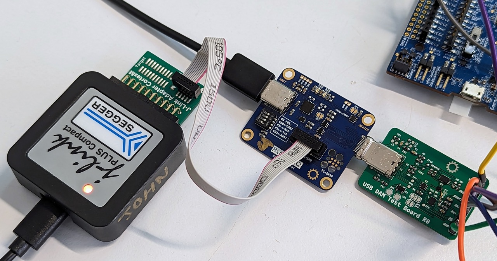
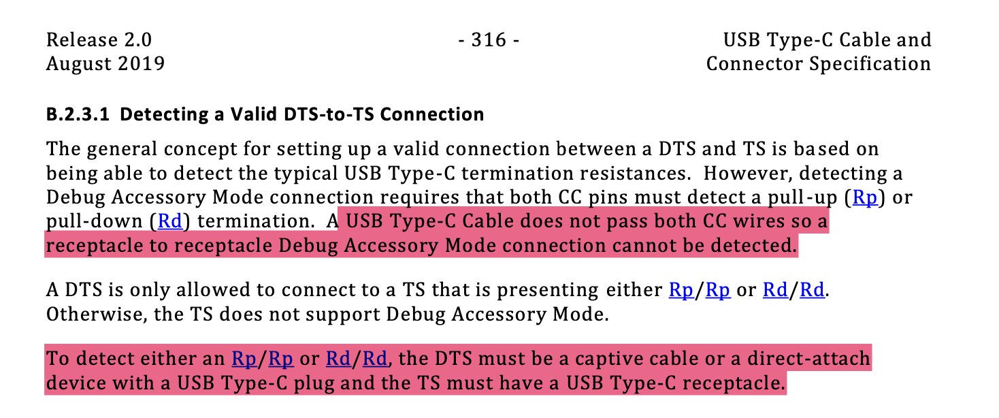

# Minnow - USB-C DAM Tool

 # NEW Image soon!

DAMLink is a tool for using DAM (Debug Accessory Mode), providing an interface to SWD or JTAG and/or Serial interface from the device. It expands upon [this concept](https://github.com/BitterAndReal/SWD-over-USB-C) to include a USB-UART and some utility for use within test rigs. This fork bases on the Minnow project, with some improvments from my side and changes to fit into our application. Above all, the extension of the use of the DAM, in that a signal can be routed via all pins, e.g. SPI / I2C / USART, offers the advantage in the application that you have the possibility to develop and debug USB accessories by connecting a logic analyzer. 

* Enables and interfaces USB DAM configured in image below; Full SWD or JTAG over USB-C.
* Provides board designer the option of using RX+ for NRST/RXD,  RX- for SWO/TXD, TX+ - for SWDIO/IO0 and TX- - for SWCLK/IO1 - for full SWD debugging or Serial interface analysis.
* Four configurable GPIO on FT230 for test rig control of UUT: power enable; RX pin control; reset.
* TagConnect TC2050 and STDC14 header to debugger (ST-Link V3, Segger J-Link or equal).
* USB pass-through or FT230 USB UART to device.
* VTARGET reference from device or external.
* Maintains USB-C rotational symmetry.
* Alternate Mode 3.1+ can still be used in the main application with normal hosts.

[Original reference](https://github.com/BitterAndReal/SWD-over-USB-C/blob/main/images/SWD%20over%20USB-C%20Pinout-01.png) modified to include option of UART.

# Status and Obtaining

# Usage

### Add new image soon ###

__Minnow connected to the USB DAM example test board - this would be integrated to a target in practice__

**Note** the target device must be designed to enable DAM mode following the USB specification and DAMLink DAM USB-C connections. I have made an example board that does this, see below.

## Cable

If a cable is required between DAMLinik and the device, the cable needs to be a **complete USB-C extension cable** with all [Alternate Mode](https://en.wikipedia.org/wiki/USB-C#Alternate_Mode) wires. USB 3.1+, DisplayPort, Thunderbolt and HDMI rated cables _should_ include these. Here are a couple: [usb-c-extension-cable-for-raspberry-pi-4](https://thepihut.com/products/usb-c-extension-cable-for-raspberry-pi-4) or [Tripp Lite U421-20N-G2](https://www.digikey.ch/en/products/detail/tripp-lite/U421-20N-G2/16161593).

USB-C extension cables are not [technically specification compliant](https://hackaday.com/2022/12/27/all-about-usb-c-illegal-adapters/) but one is required for DAM because no compliant male-male cable will supply both CC1 and CC2 between the the DTS and TS. See [USB Type-C](https://www.usb.org/sites/default/files/USB%20Type-C%20Spec%20R2.0%20-%20August%202019.pdf): B.2.3.1.

## Example Device 

I've included an example design for the device end: './example-dev/usb-dam.kicad\_pro' [pdf](./example-dev/usb-dam.pdf). It can be used for testing and as a foundation for a project with DAM. There are clearly alternative design choices that can be made based on the requirements of the device but it is a good starting point. 

Essentially the target must detect when the CC lines are pulled up with the values specified in the USB specification (500mA @5V 10kΩ on CC1 and 22kΩ on CC2). Because the CC lines might also have 5k1 pull-downs, a potential divider is created:

* CC1: Host 22kΩ pull-up to 5V and device 5.1kΩ pull-down = 0.9V
* CC2: Host 10kΩ pull-up to 5V and device 5.1kΩ pull-down = 1.7V

The example board uses two op-amps configured as non-inverting amplifiers to buffer this to a logic AND, which enables a 4-channel switch to connect the debug lines to the Alternate Mode pins.

## FAQ

### What's the default configuration? 

USB host to device; device powered; full SWD on debug headers; VCCIO from VTARGET.

# Useful Links

* [Minnow Project](https://github.com/tuna-f1sh/minnow)
* [SWD over USB-C](https://github.com/BitterAndReal/SWD-over-USB-C)
* [USB Type-C](https://www.usb.org/sites/default/files/USB%20Type-C%20Spec%20R2.0%20-%20August%202019.pdf)
* [ARM JTAG/SWD Interface](https://developer.arm.com/documentation/101636/0100/Debug-and-Trace/JTAG-SWD-Interface)
* [FT230X datasheet](https://www.ftdichip.com/Support/Documents/DataSheets/ICs/DS_FT230X.pdf)
